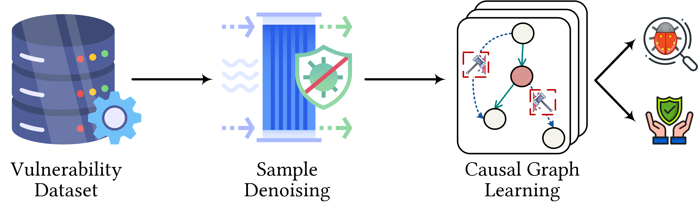

<a name="JdLRz"></a>
# Snopy: Bridging Sample Denoising with Causal Graph Learning for Effective Vulnerability Detection
<p align="center">
  
</p>

<a name="ScN0I"></a>
## Prerequisites

Install the necessary dependencies before running the project:
<a name="ZRVYs"></a>
### Environment Requirements
```
torch==1.9.0
torchvision==0.10.0
pytorch-lightning==1.4.2
tqdm>=4.62.1
wandb==0.12.0
pytest>=6.2.4
wget>=3.2
split-folders==0.4.3
omegaconf==2.1.1
torchmetrics==0.5.0
joblib>=1.0.1
```
<a name="G2LdD"></a>

### Thrid Party Liraries

- [Joern](https://github.com/joernio/joern)
- [ctags](https://github.com/universal-ctags/ctags)
- [V-SZZ](https://github.com/baolingfeng/V-SZZ)

## Dataset
The Dataset we used in the paper:

FFmpeg+QEMU [1]: https://drive.google.com/file/d/1x6hoF7G-tSYxg8AFybggypLZgMGDNHfF

Big-Vul [2]: https://drive.google.com/file/d/1-0VhnHBp9IGh90s2wCNjeCMuy70HPl8X/view?usp=sharing

DiverseVul [3]: https://drive.google.com/file/d/12IWKhmLhq7qn5B_iXgn5YerOQtkH-6RG/view


## Getting Started

This section gives the steps, explanations and examples for getting the project running.
<a name="R4vZR"></a>
### 1) Clone this repo
`$ git clone https://github.com/SnopyArtifact/Snopy.git`
<a name="HSOG5"></a>
### 2) Install Prerequisites
<a name="QvMQH"></a>
### 3) run `preprocess/dataset_process/extract_vulContext.py` for sample denoising
<a name="gr77a"></a>
### 4) run `detectors/train.py` for model training and evaluation
<a name="gr77a"></a>
## Structure
``` 
├── README.md                         <- The top-level README for developers using this project.
├── detectors                         <- Detection model used to provide prediction labels.
│   ├── configuration.py              <- Configuration scripts.
│   ├── model.py                      <- Feature encoder.
│   └── train.py                      <- Detection model training.
└──  Preprocess                       <- Preprocessing scripts.

```

## Reference

[1] Yaqin Zhou, Shangqing Liu, Jingkai Siow, Xiaoning Du, and Yang Liu. Devign: Effective vulnerability identification by learning comprehensive program semantics via graph neural networks. NeurIPS 2019.

[2] Jiahao Fan, Yi Li, Shaohua Wang, and Tien Nguyen. A C/C++ Code Vulnerability Dataset with Code Changes and CVE Summaries. MSR 2020.

[3] Yizheng Chen, Zhoujie Ding, Lamya Alowain, Xinyun Chen, and David Wagner. DiverseVul: A New Vulnerable Source Code Dataset for Deep Learning Based Vulnerability Detection. RAID 2023.
